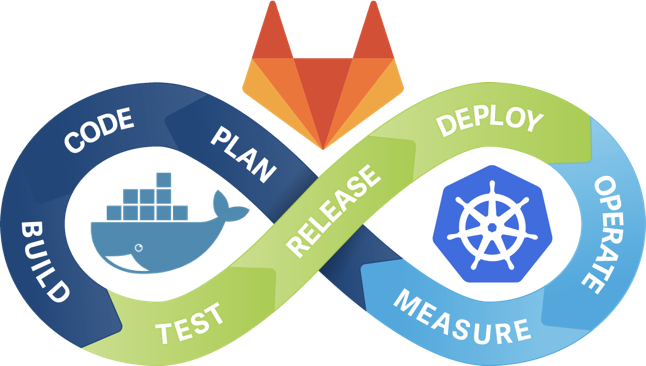
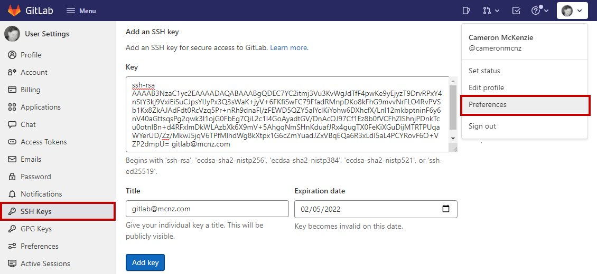

# Deploying GitLab CE on Kubernetes with Minikube

<p align="center">

</p>

This guide serves as a reference for setting up [GitLab CE v15.8.1](https://about.gitlab.com/install/ce-or-ee/) in a local Kubernetes development environment. In this guide, we’ll be using [minikube](https://minikube.sigs.k8s.io/). as it is the accepted standard.

## Local Development Environment Requirements

To deploy the k8s manifest files from this repository in the local development environment, it is necessary to install the following applications:

- [Docker v20.10.14](https://docs.docker.com/engine/install/ubuntu/)
- [Minikube v1.29.0](https://minikube.sigs.k8s.io/docs/start/#:~:text=1-,Installation,-Click%20on%20the)
- [Kubectl v1.26.0](https://kubernetes.io/docs/tasks/tools/install-kubectl-linux/)

The development environment was built on a Linux distro based on **Ubuntu 18.04 LTS**.

## Create Cluster

After installing the `Docker`, `Minikube` and `Kubectl` applications, from a terminal with administrator access (but not logged in as root), run to create a cluster locally:

For the deployment of this cluster the [recommended settings](https://docs.gitlab.com/ee/install/requirements.html#storage) resources will be used. CPU with 4 cores and 10 GB of RAM.

```
minikube start --cpus 4 --memory 10240
```

Enable ingress addon to manage external access to cluster services:

```
minikube addons enable ingress
```

Clone the repository:

```
git clone https://github.com/engmsilva/gitlab-ce-minikube.git
```

Run the deployment on the cluster:

```
cd gitlab-ce-minikube
kubectl apply -f ./gitlab
```

Wait until the GitLab `Pod` is in `Running` status:

```
kubectl get pods --namespace=gitlab

NAME                      READY     STATUS    RESTARTS   AGE
gitlab-5cf5f7bc4f-ztns5   1/1       Running   0          3h31m
```

Check the local IP that is being routed to the cluster services:

```
kubectl get ingress --namespace=gitlab

NAME             CLASS     HOSTS          ADDRESS        PORTS     AGE
gitlab-ingress   nginx     gitlab.local   192.168.49.2   80        22h
```

Add the IP from the **ADDRESS** column in the `/etc/hosts` file to resolve name to address [http://gitlab.local](http://gitlab.local):

```
192.168.49.2 gitlab.local
```

Restart the networking service:

```
sudo service network-manager restart
```

## Login

After starting the `Pod`, you can visit [http://gitlab.local](http://gitlab.local). It may take a while for the `Pod` to start responding to queries.

Visit the GitLab URL and sign in with the `root` username and password obtained through the following steps.

Access the `Pod` shell:

```
kubectl exec --stdin --tty gitlab-5cf5f7bc4f-ztns5 -n gitlab -- /bin/bash
```

In the `Pod` shell run the command:

```
grep 'Password:' /etc/gitlab/initial_root_password
```

**note:** The password file will be automatically deleted in the first reconfigure run after 24 hours.

## Cloned Repository via SSH
The 3 steps that need to be followed in order to be able to clone GitLab repositories:

- Configure the Ingress Controller to access GitLab via SSH;
- Configure an SSH key pair on the clone destination;
- Configure SSH key in GitLab user preferences.

### Configuring Ingress Controller for External GitLab Shell Access via SSH

The GitLab Shell component requires TCP traffic to pass through on port 22 (by default; this can be changed). Ingress does not directly support TCP services, so some [additional configuration is necessary](https://minikube.sigs.k8s.io/docs/tutorials/nginx_tcp_udp_ingress/).

Add the GitLab Shell service listening on port 22 to the nginx configMap:

```
kubectl patch configmap tcp-services -n ingress-nginx --patch '{"data":{"22":"gitlab/gitlab:22"}}'
```

Apply the patch on the nginx controller so that it listens on port 22:

```
kubectl patch deployment ingress-nginx-controller --patch "$(cat ./ingress-nginx/controller-patch.yaml)" -n ingress-nginx
```

### Generate an SSH key pair

Before you create a key pair, see if a key pair already exists.

```
ls /home/user/.ssh
```

If not, you need to generate a key. Run `ssh-keygen -t` followed by the key type and an optional comment. This comment is included in the created .pub file.

For 2048-bit RSA:

```
ssh-keygen -t rsa -b 2048 -C "<comment>"
```

A public key and a private key will be created. See the GitLab documentation for more [SSH key configuration options](https://docs.gitlab.com/ee/user/ssh.html) .

### Configure SSH key in GitLab User Preferences

Get the SSH public key value by running the command:

```
cat /home/user/.ssh/id_rsa.pub
```

Copy SSH key to clipboard.

Log into GitLab and click on your account preferences.

Click the SSH Keys link and paste the copied value into the text field.

Set an expiration date, and then click the blue button to persistently add the GitLab SSH key.




